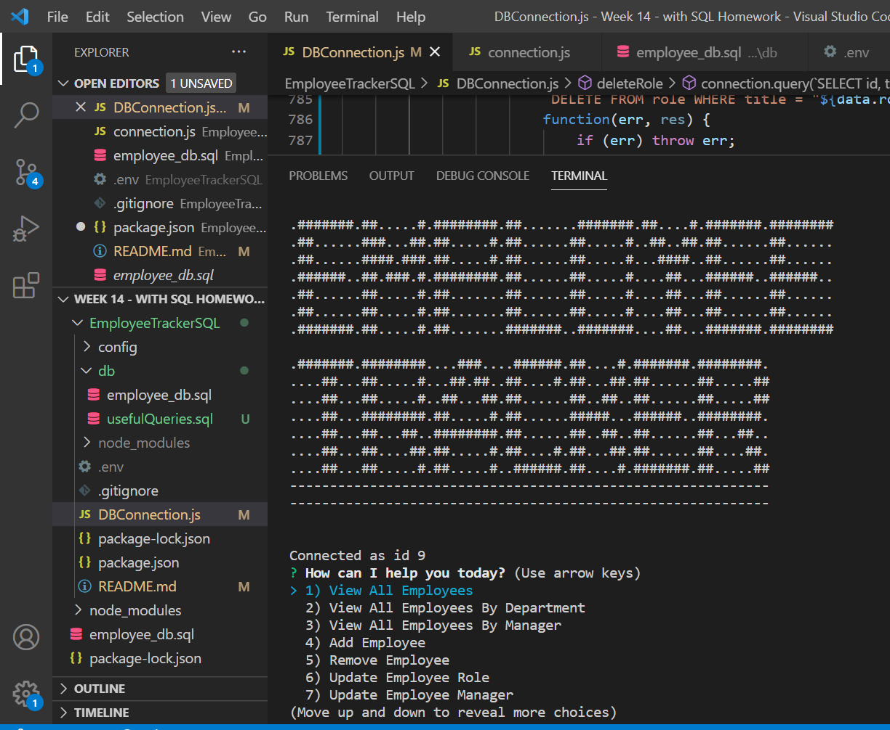
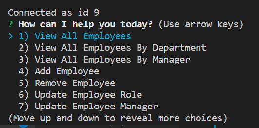
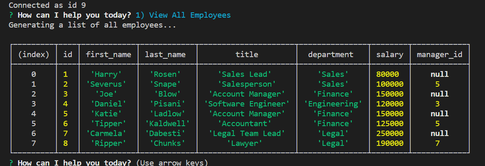

# Employee Tracker - Bootcamp Spot - Homework #12
## Author: WellAndGood

# Table of Contents
* [Overview](#overview)
* [Appearance](#appearance)
* [Features](#features)
* [Files](#files)
* [Contributors](#contributors)
* [License](#license)

# Overview

This document describes the components of an employee tracker using vanilla Javascript, Node, Express, MySQL.js and SQL queries. 

# Appearance 
Once loaded, the generated HTML page should look like this:  

You can access the `.git` files at:
https://github.com/WellAndGood/EmployeeTrackerSQL.git

A video explaining the functioning of this app can be found here:
https://www.youtube.com/watch?v=txoC2coiWXQ 

# Features

Run the app by entering `node DBConnection.js` in the terminal while the terminal is pointed towards the parent directory. This will initiate the main menu.

The following is a quick rundown of all ten functions

## 1) View All Employees 
A complex query, which combines all three tables, which provides a basic rundown of every working employee.

## 2) View All Employees By Department 
This function grabs all existing departments (via a query), presenting the departments as part of a list; another query allows us to view all working employees in the chosen department.

## 3) View All Employees By Manager 
This function grabs all existing managers (via a query), presenting them as part of a list; another query allows us to view all employees working under the chosen manager.

## 4) Add Employee
This function asks you for four elements:
- Your first name
- Your last name
- Your role (select from a queried list of existing roles)
- Your manager (select from a queried list of existing managers)

## 5) Remove Employee
This function asks you for:
- The employee you'd like to remove (from a queried list of existing workers)
- A confirmation that you'd like to remove this employee

## 6) Update Employee Role
This function asks you for:
- The employee you'd like to remove (from a queried list of existing workers)
- The role in which you'd like to place your employee (from a queried list of existing roles) 

## 7) Update Employee Manager
This function asks you for:
- The employee you'd like to remove (from a queried list of existing workers)
- The manager under which you'd like to place your employee (from a queried list of existing managers)

## 8) View budgets by department
This function asks you to select a department (from a queried list of departments).
It adds up each of the employee's salaries, returning a sum total for the department's budget.

## 9) Add role or department
This function takes you to one of three paths:
  1) Creating a new position (inside an existing department)
  2) Creating a new department
  3) Exiting

### a) Creating a new position
To create a position, you must:
- Name the role
- Choose the department (from a queried list)
- Declare the average salary
This creates a position with a unique role id number (e.g., 501)

### b) Creating a new department
To create a department, you must:
- Name the department
This creates a department with a unique department id number (e.g., 500)

## 10) Delete role or department
To delete a department, you must:
- Choose the department
- Confirm that you'd like to delete the position

# Files

File name | Function
------------ | -------------
DBConnection.js | Javascript file with employee tracker methods
package.json
**db**
employee_db.sql | Starter SQL file to initiate database and three tables 
usefulQueries.sql | Supplemental SQL file for direct queries through MySQL (not 100% correlated to the functions in the employee tracker)
**config**
connection.js | Logistics to connect to MySQL 

**How to contribute to the application**: Given that this application acts as homework, please do not contribute to this repository.

## Contributors
Daniel Pisani (WellAndGood)

# Contact
* GitHub account: WellAndGood

## License
This project is licensed under:

### MIT License

Copyright (c) 2021 Daniel Pisani (WellAndGood) 

Permission is hereby granted, free of charge, to any person obtaining a copy of this software and associated documentation files (the "Software"), to deal in the Software without restriction, including without limitation the rights to use, copy, modify, merge, publish, distribute, sublicense, and/or sell copies of the Software, and to permit persons to whom the Software is furnished to do so, subject to the following conditions:

The above copyright notice and this permission notice shall be included in all copies or substantial portions of the Software.

THE SOFTWARE IS PROVIDED "AS IS", WITHOUT WARRANTY OF ANY KIND, EXPRESS OR IMPLIED, INCLUDING BUT NOT LIMITED TO THE WARRANTIES OF MERCHANTABILITY, FITNESS FOR A PARTICULAR PURPOSE AND NONINFRINGEMENT. IN NO EVENT SHALL THE AUTHORS OR COPYRIGHT HOLDERS BE LIABLE FOR ANY CLAIM, DAMAGES OR OTHER LIABILITY, WHETHER IN AN ACTION OF CONTRACT, TORT OR OTHERWISE, ARISING FROM, OUT OF OR IN CONNECTION WITH THE SOFTWARE OR THE USE OR OTHER DEALINGS IN THE SOFTWARE.